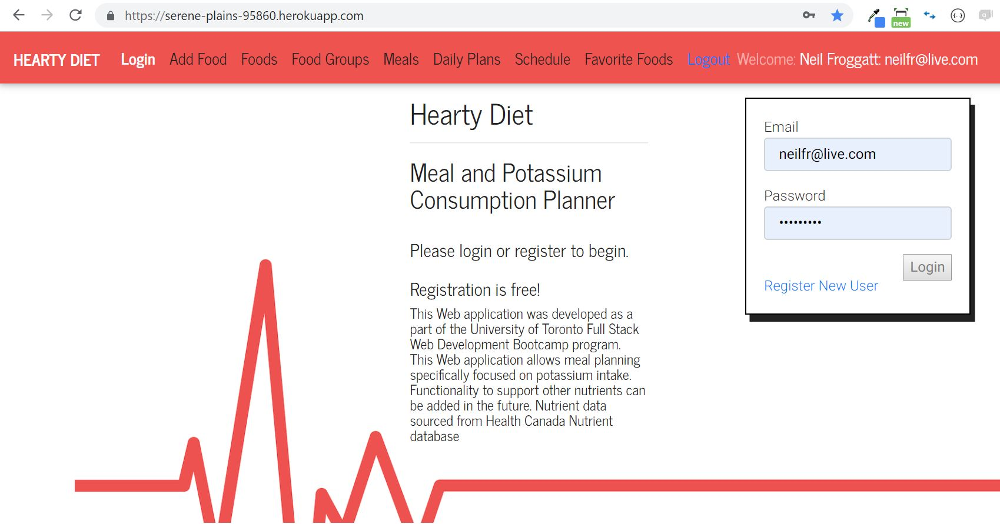
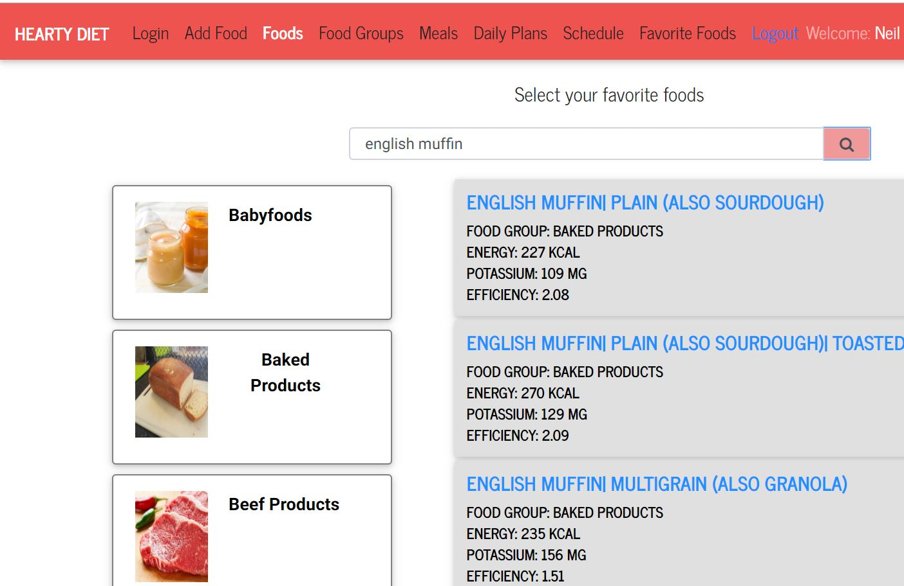
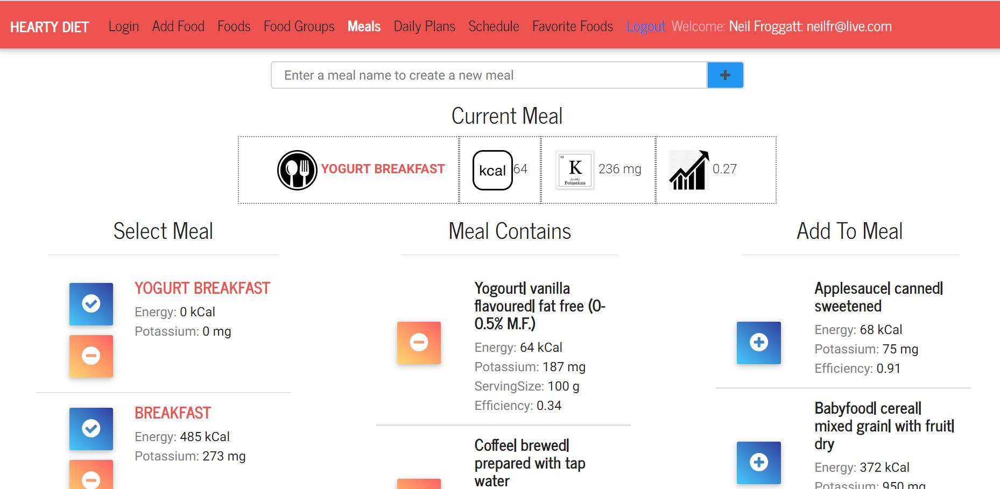
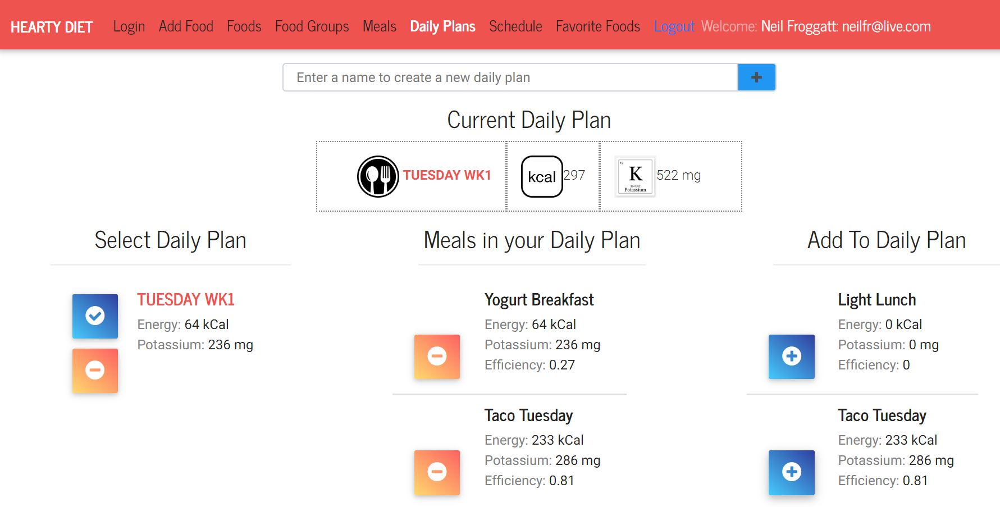
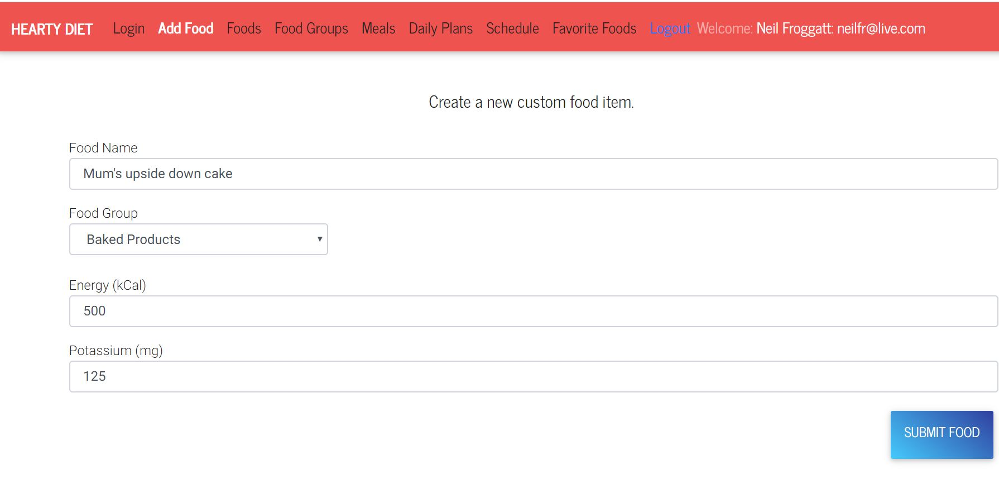

# HeartyDiet

- Diet planning application for heart failure sufferers that need to control their potassium intake

## Link

https://serene-plains-95860.herokuapp.com/

## Problem

- Heart failure management medications can signifcantly affect potassium.
- While this requires meal planning in order to maintain appropriate levels of the nutrient, there are few easy-to-access tools to help.

## Technology

- Health Canada Nutrient database, Javascript, MongoDB, mongoose, Express, React, Node, bcrypt Authentication, MDB Bootstrap, axios, MVC design pattern, Heroku, mLab

# Quick Tour of the Application

## Login

- Authentication implemented using bcrypt
  

## Select Favorite Foods

- Allows user to select foods that they frequently use to construct meals
- Foods can be selected from the Health Canada Nutrient Database, which consists of over 5000 foods, or from custom created foods
  

## Build Meal

- Allows user to select food items, from their favourites list, to construct a meal
  

## Build Daily Plan

- Allows the user to select from their list of meals, to construct a daily meal plan
  

## Add Custom Food

- Allows the user to create new custom foods that they can then add to meals
  
